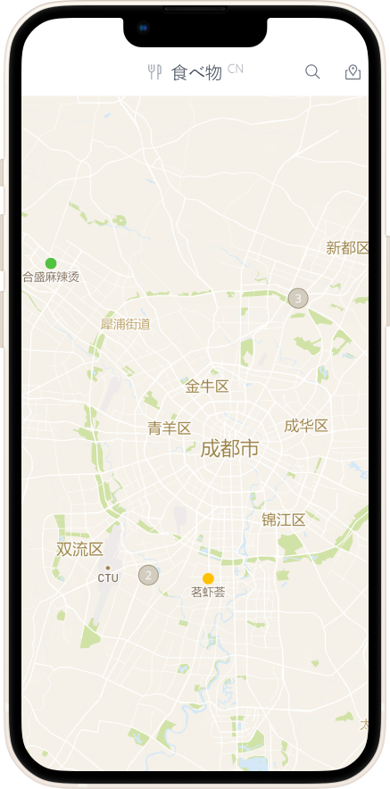

<p align="center">
  <h2 align="center">awesome-cn-food-web 中国美食地图</h2>
</p>

<p align="center">
  
  
</p>

<p align="center">
  
</p>

<p align="center">
  <span>👉 </span>
  <a href="https://food.arcticalpaca.com/" target="_blank">访问 web 应用</a>
</p>

## 特性

- Vue3 + Vite
- 极速搜索（Fuse.js）
- 响应式设计，手机版、网页版直接访问
- 人性化的地图界面（mapbox-gl）
- 调起三方地图进行导航（高德、百度地图）
- 当前位置到店铺的距离

> 💡 店铺数据仅供参考，店铺评论为本人主观意见，如有侵权请联系我删除。

## 使用

```bash
# 克隆仓库
git clone https://github.com/wjjwkwindy/awesome-cn-food-web.git

# 创建 data_food.json 文件，并录入点位数据
cp ./public/data_food.example.json ./public/data_food.json

# 安装依赖并开启本地开发
pnpm install
pnpm run dev
```

## 待办

- [ ] 使用数据库保存数据
- [ ] 使用 `vite-plugin-pwa` 添加 PWA 支持
- [ ] 直接在 APP 中添加店铺

## 特别鸣谢

受到 [antfu/awesome-cn-cafe-web](https://github.com/antfu/awesome-cn-cafe-web) 的启发

## License

MIT
